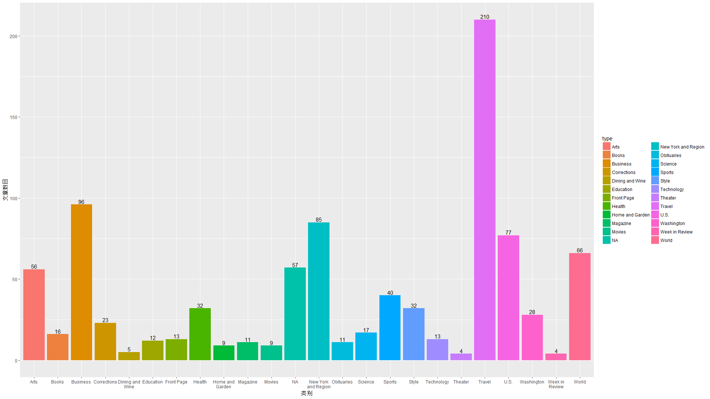
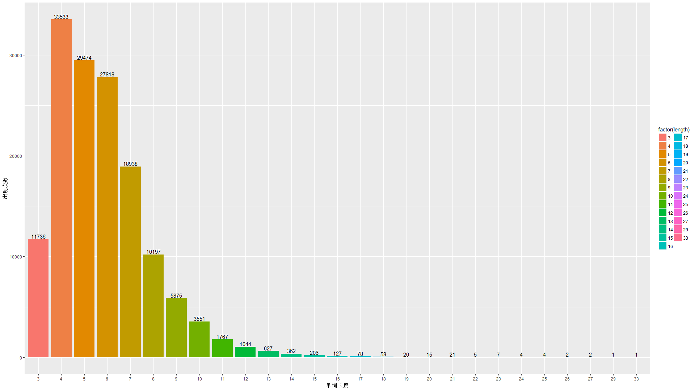
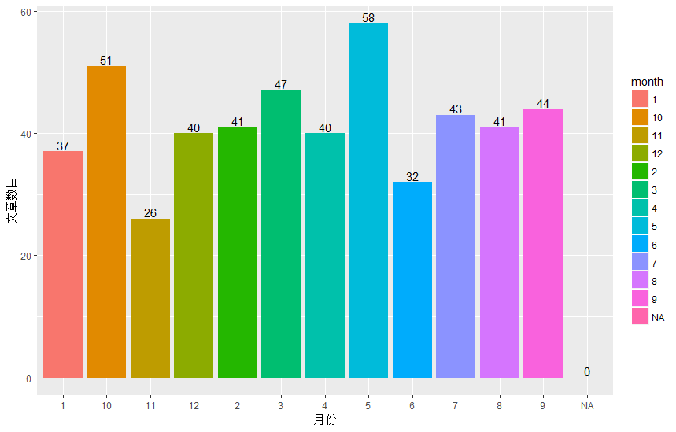

### 数据挖掘第二次作业###

计43 郭昉泽 2014011356

------

一	实验目标

（1）掌握R语言的基本使用方法

（2）掌握数据预处理的方法和技巧

二	实验过程

本实验需要使用R语言来完成任务，所以选用了windows下R语言的3.3.2版本作为解释器，选用RStudio作为编辑器来进行代码的编写。

具体代码如下：

```R
library("XML")
library("tm")
library("text2vec")
library("wordcloud")
library("ggplot2")
library("stringr")

a = list.files("C:/Users/zjkgf/Desktop/nyt_corpus/samples_500/")
dir = paste("C:/Users/zjkgf/Desktop/nyt_corpus/samples_500/",a,sep="")
n = length(dir)

alltext = c()
alltime = c()
allcategories = c()

for (i in 1:n){
  result = xmlParse(file=dir[i])
  rootnode = xmlRoot(result)
  datanode = rootnode[["body"]][["body.content"]][["block"]]
  if (!is.null(datanode)){
    fulltext = xpathApply(datanode,"//block[@class='full_text']",xmlValue)[[1]]
  } else
    fulltext = "NA"
  alltext = append(alltext,fulltext)
  headnode = rootnode[["head"]]
  year=""
  month=""
  day=""
  for (j in 1:xmlSize(headnode)){
    if (xmlName(headnode[[j]])=="meta"){
      if (xmlGetAttr(headnode[[j]],"name")=="publication_year"){
        year=xmlGetAttr(headnode[[j]],"content")
      }
      if (xmlGetAttr(headnode[[j]],"name")=="publication_month"){
        month=xmlGetAttr(headnode[[j]],"content")
      }
      if (xmlGetAttr(headnode[[j]],"name")=="publication_day_of_month"){
        day=xmlGetAttr(headnode[[j]],"content")
      }
    }
  }
  if (year!="" && month!="" && day!=""){
    time=paste(year,month,day,sep="/")
  } else if (year!="" && month!=""){
    time=paste(year,month,sep="/")
  } else if (year!=""){
    time=paste(year,sep="/")
  } else time = "NA"
  alltime = append(alltime,time)
  classify = c()
  idc = headnode[["docdata"]][["identified-content"]]
  for (j in 1:xmlSize(idc)){
    if (xmlName(idc[[j]])=="classifier"){
      class = xmlValue(idc[[j]])
      allclass = strsplit(xmlValue(idc[[j]]),'/')[[1]]
      if (length(allclass) >= 3){
      if (allclass[[1]] == "Top" && (allclass[[2]] == "News" || allclass[[2]] == "Features")){
        if (!allclass[[3]] %in% classify){
          classify = append(classify, allclass[[3]])
        }
      }
      }
    }
  }
  if (length(classify) != 0){
    temp = classify[[1]]
    if (length(classify) >= 2){
    for (j in 2:length(classify)){
      temp = paste(temp,classify[[j]],sep=",")
    }}
    allcategories = append(allcategories, temp)
  } else
  {
    allcategories = append(allcategories,"NA")
  }
}
frame = data.frame(full_text=alltext,categories=allcategories,time=alltime)
reuters = Corpus(VectorSource(alltext))
reuters = tm_map(reuters, PlainTextDocument)
reuters = tm_map(reuters, tolower)
reuters = tm_map(reuters, removeWords, stopwords("english"))
reuters = tm_map(reuters, stemDocument)
reuters = tm_map(reuters, removePunctuation)
reuters = tm_map(reuters, removeNumbers)
reuters = tm_map(reuters, stripWhitespace)
dtm = DocumentTermMatrix(reuters)
totalterm = c()
nowfreq = 1
while (TRUE){
  res = findFreqTerms(dtm,nowfreq)
  res2 = findFreqTerms(dtm,nowfreq+1)
  if (length(res) == 0 && length(res2) == 0){
    break
  }
  totalterm[[nowfreq]] = setdiff(res,res2)
  nowfreq = nowfreq + 1
}
wordnum = 0
i = length(totalterm)
top100word = c()
top100wordcount = c()
while (wordnum < 100 && i>=1){
  words = totalterm[[i]]
  for (word in words){
    wordnum = wordnum + 1
    top100word[[wordnum]] = word
    top100wordcount[[wordnum]] = i
    if (wordnum == 100){
      break
    }
  }
  i = i - 1
}
top100wordframe = data.frame(words=top100word, freq=top100wordcount)
wordcloud(top100wordframe$words,top100wordframe$freq,col = brewer.pal(8, "Set1"), min.freq = min(top100wordframe$freq),, random.color = T, max.words = max(top100wordframe$freq), random.order = T,  scale = c(4, 1))

i = length(totalterm)
totalword=c()
for (j in 1:100){
  totalword[[j]] = 0
}
while (i>=1){
  words = totalterm[[i]]
  for (word in words){
    totalword[[nchar(word)]] = totalword[[nchar(word)]]+i
  }
  i = i - 1
}
totalwordlen=c()
totalwordlennum=c()
for (i in 1:length(totalword)){
  c = totalword[[i]]
  if (c>0){
    totalwordlen = append(totalwordlen, i)
    totalwordlennum = append(totalwordlennum,c)
  }
}
totallenframe = data.frame(length=totalwordlen,count=totalwordlennum)
p = ggplot(totallenframe, aes(x=factor(length), y=count)) + geom_bar(stat="identity")+geom_text(aes(label=count), vjust=-0.2)+aes(fill=factor(length))+labs(x='单词长度', y='出现次数')

totalclass=c()
totalclassnum=c()
for (i in 1:length(alltext)){
  str = paste(frame[i,2],"",sep="")
  list = unlist(strsplit(str,","))
  for (element in list){
    have = FALSE
    for (somehow in totalclass){
      if (somehow == element){
        have=TRUE
        break
      }
    }
    if (!have){
      totalclass = append(totalclass,element)
      totalclassnum = append(totalclassnum,0)
    }
  }
}
for (i in 1:length(alltext)){
  str = paste(frame[i,2],"",sep="")
  list = unlist(strsplit(str,","))
  for (element in list){
    for (j in 1:length(totalclass)){
      if (totalclass[[j]] == element){
        totalclassnum[[j]] = totalclassnum[[j]]+1
      }
    }
  }
}
totalclassframe = data.frame(type=totalclass,count=totalclassnum)
p1 = ggplot(totalclassframe, aes(x=type, y=count)) + geom_bar(stat="identity")+geom_text(aes(label=count), vjust=-0.2)+aes(fill=type)+labs(x='类别', y='文章数目')+
  scale_x_discrete(labels = function(type) str_wrap(type, width = 10))

totalmonth=c("1","2","3","4","5","6","7","8","9","10","11","12","NA")
totalmonthnum=c(0,0,0,0,0,0,0,0,0,0,0,0,0)
for (i in 1:length(alltext)){
  str = paste(frame[i,3],"",sep="")
  list = unlist(strsplit(str,"/"))
  if (str == "NA"){
    element = "NA"
  } else{
    element=list[[2]]
  }
    for (j in 1:length(totalmonth)){
      if (totalmonth[[j]] == element){
        totalmonthnum[[j]] = totalmonthnum[[j]]+1
      }
    }
}
totalmonthframe = data.frame(month=totalmonth,count=totalmonthnum)
p2 = ggplot(totalmonthframe, aes(x=month, y=count)) + geom_bar(stat="identity")+geom_text(aes(label=count), vjust=-0.2)+aes(fill=month)+labs(x='月份', y='文章数目')+
  scale_x_discrete(labels = function(month) str_wrap(month, width = 10))

totalvec = c()
dtmmatrix = as.matrix(dtm)
vecmatrix = matrix(nrow=length(alltext),ncol=length(alltext))
for (i in 1:length(alltext)){
  for (j in 1:length(alltext)){
    x = dtmmatrix[i,]
    y = dtmmatrix[j,]
    res = sum(x*y)/sqrt((sum(x^2)*sum(y^2)))
    if (is.nan(res)){
      vecmatrix[i,j] = -1
    } else{
      vecmatrix[i,j] = res
    }
  }
  print("article")
  print(i)
}

totalclasscontent = c()
for (i in 1:length(totalclass))
{
  totalclasscontent[[i]] = list()
}
for (i in 1:length(alltext)){
  str = paste(frame[i,2],"",sep="")
  list = unlist(strsplit(str,","))
  for (element in list){
    for (j in 1:length(totalclass)){
      if (totalclass[[j]] == element){
        totalclasscontent[[j]] = append(totalclasscontent[[j]],i)
      }
    }
  }
}

totaldegree = c()
for (i in 1:length(totalclass)){
  ts = totalclasscontent[[i]]
  count = 0.0
  total = 0.0
  for (j in 1:length(ts)){
    for (k in 1:length(ts)){
      if (j != k){
        x = dtmmatrix[ts[[j]],]
        y = dtmmatrix[ts[[k]],]
        count = count + 1
        res = sum(x*y)/sqrt((sum(x^2)*sum(y^2)))
        if (is.nan(res)){
          res = -1
        }
        total = total + res
      }
    }
  }
  totaldegree = append(totaldegree,total/count)
}
for (i in 1:length(totalclass)){
  print(paste("类别",totalclass[[i]],"的相似度为："))
  print(totaldegree[[i]])
}

class1 = 21
class2 = 5
count = 0.0
total = 0.0
ts1 = totalclasscontent[[class1]]
ts2 = totalclasscontent[[class2]]
for (j in 1:length(ts1)){
  for (k in 1:length(ts2)){
      x = dtmmatrix[ts1[[j]],]
      y = dtmmatrix[ts2[[k]],]
      count = count + 1
      res = sum(x*y)/sqrt((sum(x^2)*sum(y^2)))
      if (is.nan(res)){
        res = -1
      }
      total = total + res
  }
}
print(paste("类别",totalclass[[class1]],"与类别",as.character(totalclass[[class2]]),"的相似度为："))
print(total/count)
```

以上代码只需要修改路径（R语言相对路径处理很差，所以使用绝对路径，请改为相应的路径），装好相应的依赖包（涉及到的所有包均可开头引用，如果有相关包的缺失可利用install.packages("包名")进行安装，然后即可运行。运行之后默认只会输出一张图片，就是wordcloud云图，运行后在控制台内输入p即可输出单词长度的分布情况，输入p1即可输出每一个类别下的新闻数量的分布情况，输入p2即可输出每个月新闻数量的分布情况。

注意有一个隐含的依赖：RColorBrewer，在头文件并未包括，但是需要安装。

以下按照顺序讲解每一步的实现细节：

第一步：数据读入与建立数据框对象

```R
a = list.files("C:/Users/zjkgf/Desktop/nyt_corpus/samples_500/")
dir = paste("C:/Users/zjkgf/Desktop/nyt_corpus/samples_500/",a,sep="")
n = length(dir)
```

这三行代码实现了列出一个文件夹下所有文件的功能。由于R语言对相对路径支持较差，这里使用了绝对路径，需要根据需求进行修改。 

```R
alltext = c()
alltime = c()
allcategories = c()

for (i in 1:n){
  result = xmlParse(file=dir[i])
  rootnode = xmlRoot(result)
  datanode = rootnode[["body"]][["body.content"]][["block"]]
  if (!is.null(datanode)){
    fulltext = xpathApply(datanode,"//block[@class='full_text']",xmlValue)[[1]]
    #解析出正文，用这种方法可以避免处理</p>带来的麻烦
  } else
    fulltext = "NA"
    #正文也有可能不存在
  alltext = append(alltext,fulltext)
  headnode = rootnode[["head"]]
  year=""
  month=""
  day=""
  for (j in 1:xmlSize(headnode)){
    if (xmlName(headnode[[j]])=="meta"){
      if (xmlGetAttr(headnode[[j]],"name")=="publication_year"){
        year=xmlGetAttr(headnode[[j]],"content")
      }
      if (xmlGetAttr(headnode[[j]],"name")=="publication_month"){
        month=xmlGetAttr(headnode[[j]],"content")
      }
      if (xmlGetAttr(headnode[[j]],"name")=="publication_day_of_month"){
        day=xmlGetAttr(headnode[[j]],"content")
      }
    }
  }
    #以上一重循环找出年月日，由于可能月或者日不存在，也有可能都不存在，所以需要进行一定的处理
  if (year!="" && month!="" && day!=""){
    time=paste(year,month,day,sep="/")
  } else if (year!="" && month!=""){
    time=paste(year,month,sep="/")
  } else if (year!=""){
    time=paste(year,sep="/")
  } else time = "NA"
  alltime = append(alltime,time)
    #将时间打包成年/月/日的格式，即转化为字符串，存入alltime
  classify = c()
  idc = headnode[["docdata"]][["identified-content"]]
  for (j in 1:xmlSize(idc)){
    if (xmlName(idc[[j]])=="classifier"){
      class = xmlValue(idc[[j]])
      allclass = strsplit(xmlValue(idc[[j]]),'/')[[1]]
      if (length(allclass) >= 3){
      if (allclass[[1]] == "Top" && (allclass[[2]] == "News" || allclass[[2]] == "Features")){
        if (!allclass[[3]] %in% classify){
          classify = append(classify, allclass[[3]])
        }
      }
      }
    }
  }
    #只有满足一定的条件才是分类，以上判断条件是否满足同时提取出真正的分类
  if (length(classify) != 0){
    temp = classify[[1]]
    if (length(classify) >= 2){
    for (j in 2:length(classify)){
      temp = paste(temp,classify[[j]],sep=",")
    }}
    allcategories = append(allcategories, temp)
  } else
  {
    allcategories = append(allcategories,"NA")
  }
    #分类可能有多个，所以需要用逗号隔开使其转化为字符串，也有可能不存在，此时分类为NA
}
frame = data.frame(full_text=alltext,categories=allcategories,time=alltime)
    #必要的数据获取完毕，建立dataframe，第一步完成
```

以上的代码实现了读取每一个文件，对其进行xml解析，并将数据存到alltext（所有的文章正文），alltime（所有的时间），allcategories（所有的分类）这三个vector中，其中一篇文章对应alltext，alltime和allcategories的相同位置。这三个vector每一项均为一个字符串。具体解析过程请看代码注释。

解析完成后，按照三个vector的内容建立一个dataframe，第一步完成。


第二步：新闻全文的预处理和转化为BagOfWord向量

```R
reuters = Corpus(VectorSource(alltext))
#inspect(reuters)
reuters = tm_map(reuters, PlainTextDocument)
reuters = tm_map(reuters, tolower)
reuters = tm_map(reuters, removeWords, stopwords("english"))
reuters = tm_map(reuters, stemDocument)
reuters = tm_map(reuters, removePunctuation)
reuters = tm_map(reuters, removeNumbers)
reuters = tm_map(reuters, stripWhitespace)
dtm = DocumentTermMatrix(reuters)
```

这里利用tm库的功能，依次使正文转化为纯文本，转化为纯小写，去掉英文的终结符，词干化处理，去掉标点符号，去除数字，去除多余的空白，然后将处理后的文本转化为bagofword向量。此时dtm是一个矩阵，dtm的第i行即为第i篇文章对应的BagOfWord向量。


第三步：画出出现最多的100个词的云图

```R
totalterm = c()
nowfreq = 1
while (TRUE){
  res = findFreqTerms(dtm,nowfreq)
  res2 = findFreqTerms(dtm,nowfreq+1)
  if (length(res) == 0 && length(res2) == 0){
    break
  }
  totalterm[[nowfreq]] = setdiff(res,res2)
  nowfreq = nowfreq + 1
}
wordnum = 0
i = length(totalterm)
top100word = c()
top100wordcount = c()
while (wordnum < 100 && i>=1){
  words = totalterm[[i]]
  for (word in words){
    wordnum = wordnum + 1
    top100word[[wordnum]] = word
    top100wordcount[[wordnum]] = i
    if (wordnum == 100){
      break
    }
  }
  i = i - 1
}
top100wordframe = data.frame(words=top100word, freq=top100wordcount)
wordcloud(top100wordframe$words,top100wordframe$freq,col = brewer.pal(8, "Set1"), min.freq = min(top100wordframe$freq),, random.color = T, max.words = max(top100wordframe$freq), random.order = T,  scale = c(4, 1))
```

tm库生成的bagofword矩阵可以使用一个findFreqTerms(a,b)的方法，这个可以求出在a对应的bagofword矩阵中出现频数至少为b次的所有词汇。由于出现次数为整数，所以findFreqTerms(dtm,i)与findFreqTerms(dtm,i+1)的差集即为出现频数正好为b次的所有词汇。用这个思路可以求出出现次数为一个值的所有单词。

这样即可找出出现频数最多的100个词。只需要从出现频数最大的词开始往小找，找够100个结束即可。

使用wordcloud库绘制云图时，首先需要知道这100个词是什么，出现频数是多少，然后建立dataframe，根据这个dataframe来绘制云图即可。事实上云图是彩色的， random.color = T这里使云图从黑白变成了彩色。


第四步：给出单词的分布情况并画出直方图

```R
i = length(totalterm)
totalword=c()
for (j in 1:100){
  totalword[[j]] = 0
}
while (i>=1){
  words = totalterm[[i]]
  for (word in words){
    totalword[[nchar(word)]] = totalword[[nchar(word)]]+i
  }
  i = i - 1
}
totalwordlen=c()
totalwordlennum=c()
for (i in 1:length(totalword)){
  c = totalword[[i]]
  if (c>0){
    totalwordlen = append(totalwordlen, i)
    totalwordlennum = append(totalwordlennum,c)
  }
}
totallenframe = data.frame(length=totalwordlen,count=totalwordlennum)
p = ggplot(totallenframe, aes(x=factor(length), y=count)) + geom_bar(stat="identity")+geom_text(aes(label=count), vjust=-0.2)+aes(fill=factor(length))+labs(x='单词长度', y='出现次数')
```

第三步已经求出了每个单词的出现次数，所以我们需要遍历每个出现过的单词，根据它的长度，将它的出现次数加到对应长度单词的出现次数即可。然后依然组织成dataframe格式，并使用ggplot2库的ggplot函数进行绘制。

ggplot并不会主动输出plot的图象，所以在执行完成后，需要输入p来查看并保存图象。


第五步：给出每一个类别新闻数量的分布和每一个月份新闻数量的分布直方图

```R
totalclass=c()
totalclassnum=c()
for (i in 1:length(alltext)){
  str = paste(frame[i,2],"",sep="")
  list = unlist(strsplit(str,","))
  for (element in list){
    have = FALSE
    for (somehow in totalclass){
      if (somehow == element){
        have=TRUE
        break
      }
    }
    if (!have){
      totalclass = append(totalclass,element)
      totalclassnum = append(totalclassnum,0)
    }
  }
}
for (i in 1:length(alltext)){
  str = paste(frame[i,2],"",sep="")
  list = unlist(strsplit(str,","))
  for (element in list){
    for (j in 1:length(totalclass)){
      if (totalclass[[j]] == element){
        totalclassnum[[j]] = totalclassnum[[j]]+1
      }
    }
  }
}
totalclassframe = data.frame(type=totalclass,count=totalclassnum)
p1 = ggplot(totalclassframe, aes(x=type, y=count)) + geom_bar(stat="identity")+geom_text(aes(label=count), vjust=-0.2)+aes(fill=type)+labs(x='类别', y='文章数目')+
  scale_x_discrete(labels = function(type) str_wrap(type, width = 10))

totalmonth=c("1","2","3","4","5","6","7","8","9","10","11","12","NA")
totalmonthnum=c(0,0,0,0,0,0,0,0,0,0,0,0,0)
for (i in 1:length(alltext)){
  str = paste(frame[i,3],"",sep="")
  list = unlist(strsplit(str,"/"))
  if (str == "NA"){
    element = "NA"
  } else{
    element=list[[2]]
  }
    for (j in 1:length(totalmonth)){
      if (totalmonth[[j]] == element){
        totalmonthnum[[j]] = totalmonthnum[[j]]+1
      }
    }
}
totalmonthframe = data.frame(month=totalmonth,count=totalmonthnum)
p2 = ggplot(totalmonthframe, aes(x=month, y=count)) + geom_bar(stat="identity")+geom_text(aes(label=count), vjust=-0.2)+aes(fill=month)+labs(x='月份', y='文章数目')+
  scale_x_discrete(labels = function(month) str_wrap(month, width = 10))
```

方法与第四步十分类似。实际上一篇文章对应的类别可能有多个，所以这个直方图将所有的数据加起来的和应该比500要大，而月份的和是500定值。这里把NA也看成一类（没有类别也是一类），所以绘图时这一列是存在的。

同理，这两个图也不会主动输出，需要输入p1和p2才能输出这两个图象。

注意：月份不是从1-12排序的，顺序比较特殊


第六步：新闻相似度计算

```R
totalvec = c()
dtmmatrix = as.matrix(dtm)
#转化为matrix格式，否则难以提取出向量
vecmatrix = matrix(nrow=length(alltext),ncol=length(alltext))
#这个矩阵是余弦相似度矩阵，大小为新闻数目*新闻数目
for (i in 1:length(alltext)){
  for (j in 1:length(alltext)){
    x = dtmmatrix[i,]
    y = dtmmatrix[j,]
    res = sum(x*y)/sqrt((sum(x^2)*sum(y^2))) 
    #这一行求出两个向量余弦相似度的值，有可能为NAN（因为有空文章），所以需要特殊处理
    if (is.nan(res)){
      vecmatrix[i,j] = -1
    } else{
      vecmatrix[i,j] = res
    }
  }
  print("article")
  print(i)
  #这里速度较慢，所以加入了进度提示，输出到500说明处理完毕（文章共有500篇）
}

totalclasscontent = c()
for (i in 1:length(totalclass))
{
  totalclasscontent[[i]] = list()
}
for (i in 1:length(alltext)){
  str = paste(frame[i,2],"",sep="")
  list = unlist(strsplit(str,","))
  for (element in list){
    for (j in 1:length(totalclass)){
      if (totalclass[[j]] == element){
        totalclasscontent[[j]] = append(totalclasscontent[[j]],i)
      }
    }
  }
}
#对每个类别求平均相似度的第一步是求出每个类别有哪些文章，这里是vector嵌套list来存储信息

totaldegree = c()
for (i in 1:length(totalclass)){
  ts = totalclasscontent[[i]]
  count = 0.0
  total = 0.0
  for (j in 1:length(ts)){
    for (k in 1:length(ts)){
      if (j != k){
        x = dtmmatrix[ts[[j]],]
        y = dtmmatrix[ts[[k]],]
        count = count + 1
        res = sum(x*y)/sqrt((sum(x^2)*sum(y^2)))
        if (is.nan(res)){
          res = -1
        }
        total = total + res
      }
    }
  }
  totaldegree = append(totaldegree,total/count)
}
for (i in 1:length(totalclass)){
  print(paste("类别",totalclass[[i]],"的相似度为："))
  print(totaldegree[[i]])
}
#知道了每个类别有哪些文章就可以求出平均值了。这里的处理是略过两篇文章相同的情况，空文章与任意一篇文章的相似度均为-1

class1 = 21
class2 = 5
count = 0.0
total = 0.0
ts1 = totalclasscontent[[class1]]
ts2 = totalclasscontent[[class2]]
for (j in 1:length(ts1)){
  for (k in 1:length(ts2)){
      x = dtmmatrix[ts1[[j]],]
      y = dtmmatrix[ts2[[k]],]
      count = count + 1
      res = sum(x*y)/sqrt((sum(x^2)*sum(y^2)))
      if (is.nan(res)){
        res = -1
      }
      total = total + res
  }
}
print(paste("类别",totalclass[[class1]],"与类别",as.character(totalclass[[class2]]),"的相似度为："))
print(total/count)
#这里的处理稍有不同，考虑了两篇文章相同的情况
```

具体处理请参见代码注释。这里利用了之前求出的dtm矩阵，利用这个矩阵可以方便地求出一篇文章对应的bagofword向量。


三	实验结果

wordcloud云图如下：


said的出现次数显然是最多的。

每一类别下新闻数量的分布情况如下：



NA也是一个类别。

单词长度的分布情况如下：



长度为4的单词出现次数是最多的。

每个月新闻数量的分布情况如下：



分布较为平均，但6月和11月较少。

新闻相似度计算结果如下：

```
[1] "类别 U.S. 的相似度为："
[1] 0.1318625
[1] "类别 Travel 的相似度为："
[1] 0.04809582
[1] "类别 World 的相似度为："
[1] 0.1199148
[1] "类别 Sports 的相似度为："
[1] 0.1158667
[1] "类别 Arts 的相似度为："
[1] 0.09281368
[1] "类别 Business 的相似度为："
[1] 0.1033884
[1] "类别 Theater 的相似度为："
[1] 0.1768193
[1] "类别 Style 的相似度为："
[1] 0.08650736
[1] "类别 Health 的相似度为："
[1] 0.1260611
[1] "类别 Magazine 的相似度为："
[1] 0.0419312
[1] "类别 Science 的相似度为："
[1] 0.1297683
[1] "类别 Washington 的相似度为："
[1] 0.1174865
[1] "类别 Front Page 的相似度为："
[1] -0.06035609
[1] "类别 Home and Garden 的相似度为："
[1] 0.1068731
[1] "类别 Week in Review 的相似度为："
[1] 0.05255884
[1] "类别 Books 的相似度为："
[1] 0.1204119
[1] "类别 NA 的相似度为："
[1] 0.04521799
[1] "类别 New York and Region 的相似度为："
[1] 0.05661122
[1] "类别 Corrections 的相似度为："
[1] 0.04972705
[1] "类别 Technology 的相似度为："
[1] 0.1012346
[1] "类别 Education 的相似度为："
[1] 0.2169392
[1] "类别 Movies 的相似度为："
[1] 0.1121849
[1] "类别 Obituaries 的相似度为："
[1] 0.08914596
[1] "类别 Dining and Wine 的相似度为："
[1] 0.106823
[1] "类别 Education 与类别 Arts 的相似度为："
[1] 0.08808918
```


------

四	推荐的类库

这里推荐一个可以与ggplot共同使用的很实用的库，是stringr。这个库可以解决以下问题：在显示类别的时候字符串太长会导致重叠。

导入stringr库之后可以利用这样一句话：

+scale_x_discrete(labels = function(month) str_wrap(month, width = 10))

来让每一行只显示10个字符串，并进行适时地换行。这非常有利于图片的美观。


另外一个隐藏的类库（RColorBrewer）是给wordcloud云图和ggplot上色的利器。推荐安装。